# Patient Management Dashboard

React 18 ve TypeScript ile geliştirilmiş bir hasta yönetim paneli. Uygulama; API'den hasta kayıtlarını görüntülemeye, yerel CRUD işlemleri yapmaya, arama, filtreleme, sıralama ve Türkçe/İngilizce dil desteği sunmaya olanak tanır.

## Özellikler

* API'den hasta verisi çekme
* Yerel olarak yeni hasta ekleme
* Mevcut hasta kayıtlarını düzenleme
* Hasta kayıtlarını yerel olarak silme
* İsme göre hasta arama
* Duruma göre filtreleme
* Randevu tarihine göre sıralama
* Frontend tarafında pagination (sayfa başına 10 kayıt)
* Mobilde swipe ile düzenleme ve silme işlemleri
* Hasta detay modalı
* Türkçe / İngilizce dil desteği
* Responsive tasarım

## Tech Stack

* React 18
* TypeScript
* Redux Toolkit
* React Router
* Axios
* i18next
* Tailwind CSS
* Vite
* Vitest
* react-swipeable-list

## Proje Yapısı

Proje Atomic Design yaklaşımıyla organize edilmiştir.

```text
components/
├── atoms
├── molecules
├── organisms
└── templates
```

## Live Demo

https://patient-management-dashboard-livid.vercel.app/

## Notlar

Bu proje teknik bir case study olarak geliştirilmiştir. Hasta verileri API üzerinden çekilir. Ekleme, güncelleme ve silme işlemleri Redux state üzerinden yerel olarak yönetilir.

## Dil Desteği

Uygulama arayüzünde Türkçe ve İngilizce desteklenmektedir. Arayüz metinleri seçilen dile göre çevrilir. Hasta verileri (isim, bölüm, durum vb.) API'den geldiği haliyle gösterilir.

## Pagination

Hasta listeleri frontend tarafında sayfalanmaktadır. `usePagination` hook'u filtrelenmiş sonuçları sayfa başına 10 kayıt olacak şekilde böler. Arama, filtreleme veya sıralama kriterleri değiştiğinde aktif sayfa otomatik olarak ilk sayfaya döner.

Pagination hem masaüstü tablo görünümünde hem de mobil kart görünümünde kullanılmaktadır.

## Mobil Swipe Aksiyonları

Mobil cihazlarda hasta kartları `react-swipeable-list` kütüphanesi kullanılarak kaydırılabilir.

* Sağa kaydırma → Düzenleme
* Sola kaydırma → Silme

Alternatif olarak kullanıcılar işlemleri üç nokta menüsü üzerinden de gerçekleştirebilir.


## Testler

Proje içerisinde temel UI bileşenleri ve yardımcı fonksiyonlar Vitest kullanılarak test edilmiştir.

=> Test edilen dosyalar:
Button.test.tsx
Input.test.tsx
formatDate.test.ts
patientStatus.test.ts


## Ekran Görüntüleri

### Masaüstü

**Ana dashboard — hasta listesi**

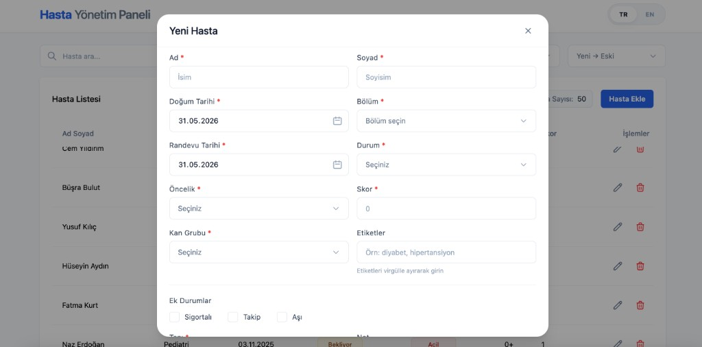

**Arama ve filtreleme**

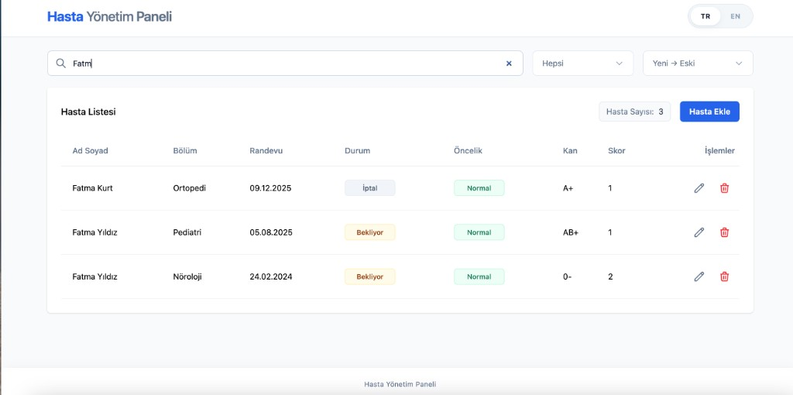

**Hasta detay modalı**

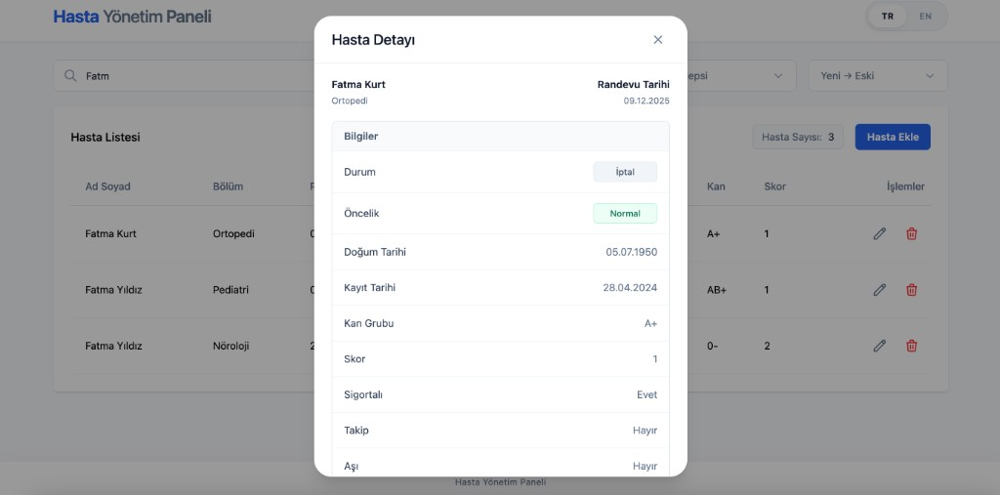

**Yeni hasta ekleme**

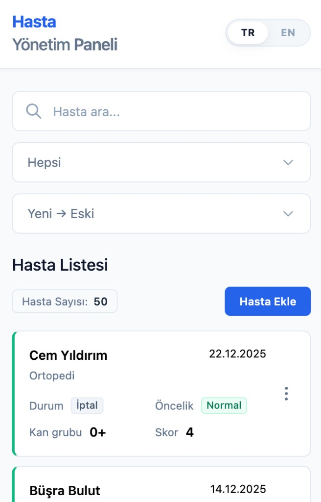

**Hasta düzenleme**

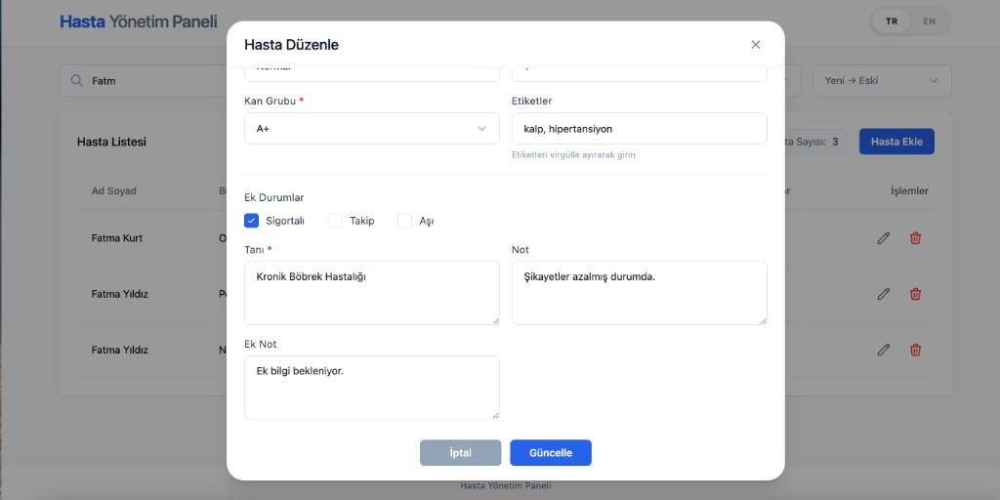

**Silme onayı**

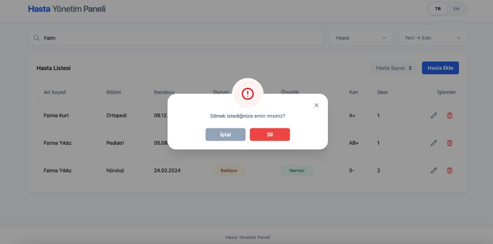

### Mobil

**Hasta listesi (kart görünümü)**

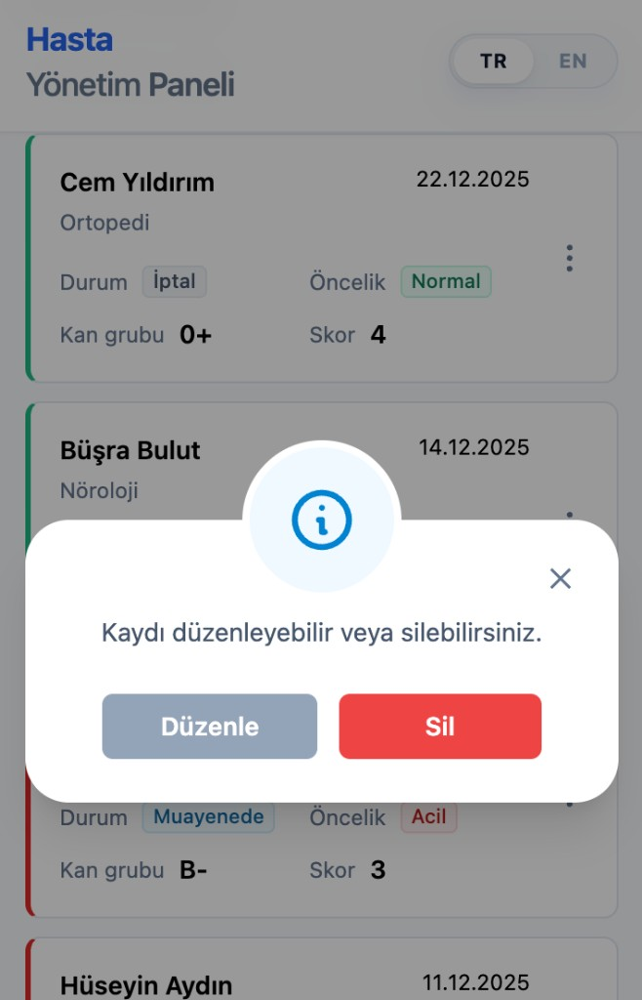

**Hasta kartları**

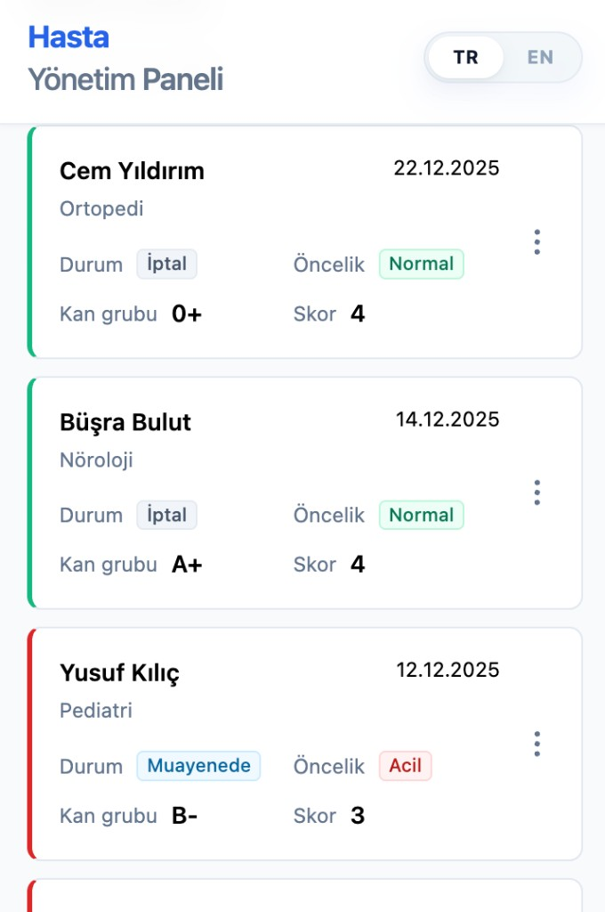

**Hasta detay modalı**

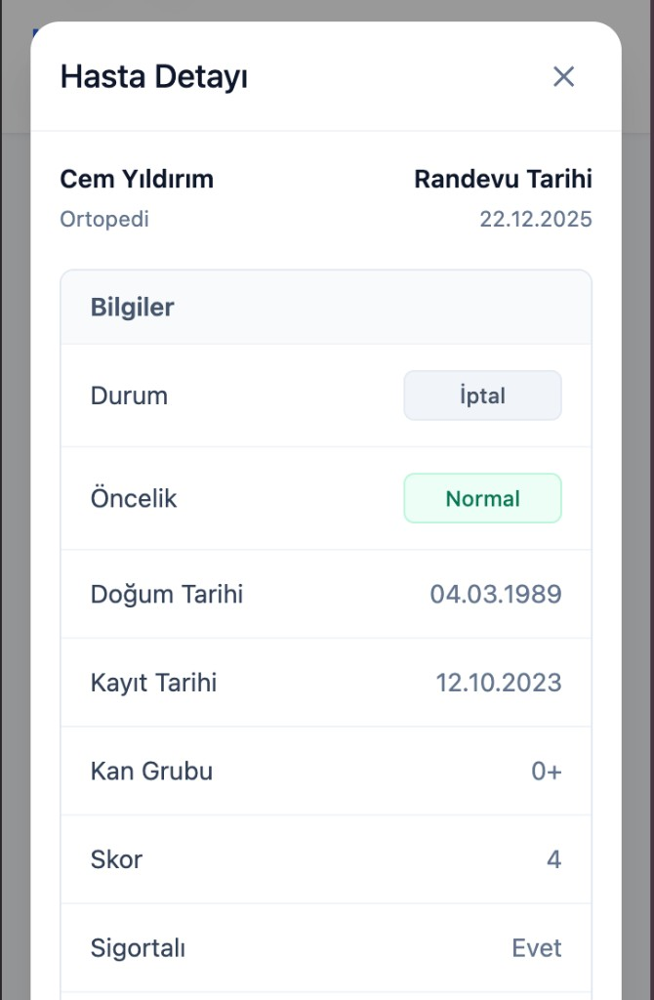

**İşlem menüsü (düzenle / sil)**

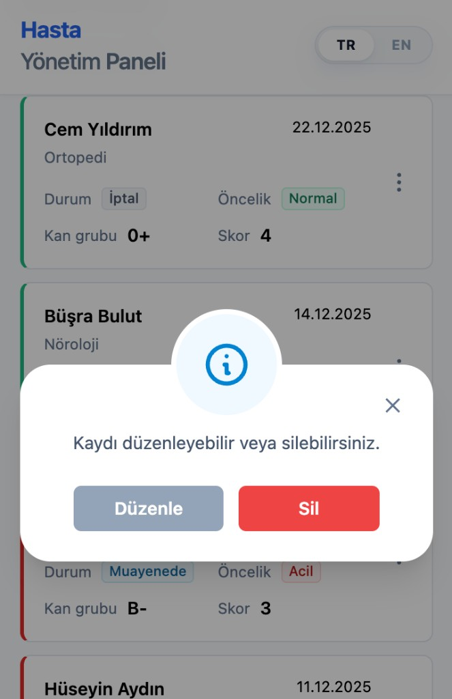

**Swipe ile düzenleme**

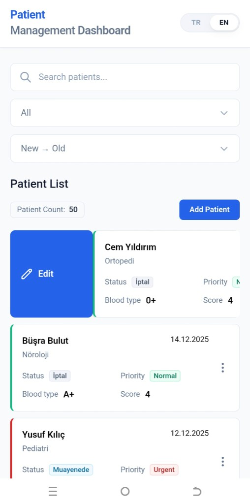

**Hasta düzenleme**

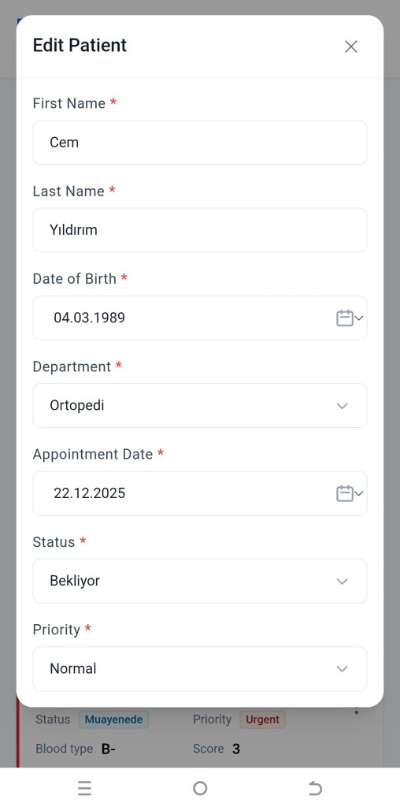

**İngilizce arayüz**

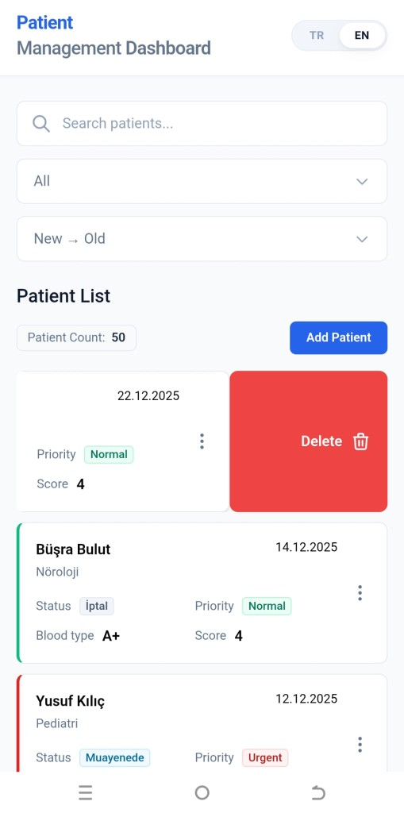

